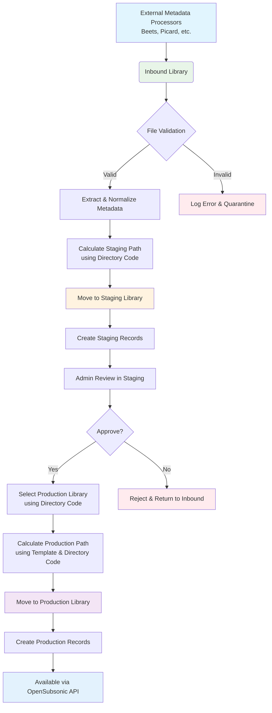
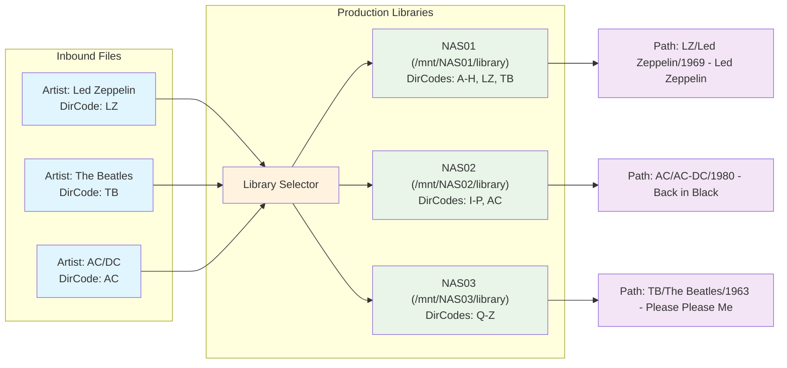

# Media File Processing in Go-based Melodee System

**Audience:** Backend engineers, worker/FFmpeg implementers

**Purpose:** Canonical description of the media pipeline and processing rules.

**Source of truth for:** Inbound→staging→production flows, FFmpeg profiles, checksums/idempotency, quarantine, and library selection behavior.

## Overview

This document outlines the media file processing pipeline for the Go-based Melodee system. The processing follows a three-stage workflow: inbound → staging → production, allowing for preprocessing with external tools, manual review, and intelligent distribution to production libraries based on configurable rules.

## Processing Pipeline Architecture

### 1. Inbound Library (Pre-processed Media)
- **Purpose**: Entry point for pre-processed media files
- **Content**: Media files processed by external tools (Beets, Picard, etc.)
- **Directory Structure**: Organized by external processing tools
- **Status**: Ready for system ingestion and validation

### 2. Staging Library (Review Area)
- **Purpose**: Pre-production review and metadata verification
- **Content**: Files organized according to Melodee's directory structure
- **Directory Structure**: Uses artist directory codes and configurable templates
- **Status**: Ready for admin/editor approval before production

### 3. Production Libraries (Active Serving)
- **Purpose**: Final serving locations for streaming
- **Content**: Approved media files organized for optimal performance
- **Directory Structure**: Optimized with directory codes to prevent deep hierarchies
- **Status**: Actively served to clients via OpenSubsonic API

## Operational Parameters
- FFmpeg profiles:
  - `transcode_high`: `-c:a libmp3lame -b:a 320k -ar 44100 -ac 2`
  - `transcode_mid`: `-c:a libmp3lame -b:a 192k -ar 44100 -ac 2`
  - `transcode_opus_mobile`: `-c:a libopus -b:a 96k -application audio`
- Concurrency caps: inbound validation 4 workers, staging promotion 2, transcoding 2; configurable via `PROCESSING_CONCURRENCY_*`.
- Retries: max 3 attempts/file with exponential backoff (2s, 4s, 8s); on final failure mark `quarantined` with reason code.
- Checksums: compute SHA256 on inbound, store in `crc_hash`, re-validate pre-promotion; mismatch → quarantine.
- Quarantine handling: move to `/quarantine/<reason>/<date>/`, persist audit log; UI should surface and allow retry.
- Idempotency: inbound skips previously processed checksum+mtime unless `force=true`; staging promotion wraps DB + file move as one logical transaction and restores file on failure.
- Capacity detection: production libraries refreshed every 10 minutes via `df` or platform equivalent; warn at 80%, stop allocations at 90% and quarantine with reason `disk_full`.
- Multi-disc handling: staging expects `CD<number>`/`Disc <number>` directories; disc number must be set in DB and tags before promotion; missing disc info → quarantine `metadata_conflict`.
- Cue sheets: if `.cue` present, store link and require referenced audio exists; otherwise quarantine `cue_missing_audio`.

## Processing Workflow Diagram



## Directory Code Distribution Diagram



## File Processing Workflow

### Stage 1: Inbound Processing
```go
type InboundProcessor struct {
    config     *ProcessingConfig
    fileSystem *FileSystemService
    validator  *MediaFileValidator
}

// ProcessInbound processes files from inbound directory
func (ip *InboundProcessor) ProcessInbound() error {
    files, err := ip.fileSystem.GetFilesInDirectory(ip.config.InboundDir)
    if err != nil {
        return fmt.Errorf("failed to get files in inbound directory: %w", err)
    }

    for _, file := range files {
        if err := ip.processFile(file); err != nil {
            ip.logger.Error().Err(err).Str("file", file.Path).Msg("Failed to process inbound file")
            continue
        }
    }

    return nil
}

// processFile validates and prepares a file for staging
func (ip *InboundProcessor) processFile(file MediaFile) error {
    // 1. Validate file integrity and format
    if err := ip.validator.Validate(file); err != nil {
        return fmt.Errorf("file validation failed: %w", err)
    }

    // 2. Extract metadata using embedded libraries
    metadata, err := ip.extractMetadata(file)
    if err != nil {
        return fmt.Errorf("metadata extraction failed: %w", err)
    }

    // 3. Normalize metadata according to system rules
    normalizedMetadata := ip.normalizeMetadata(metadata)

    // 4. Determine destination in staging area using directory code
    stagingPath, err := ip.calculateStagingPath(normalizedMetadata)
    if err != nil {
        return fmt.Errorf("failed to calculate staging path: %w", err)
    }

    // 5. Move file to staging with normalized structure
    if err := ip.fileSystem.MoveFile(file.Path, stagingPath); err != nil {
        return fmt.Errorf("failed to move file to staging: %w", err)
    }

    // 6. Create database records in staging state
    if err := ip.createStagingRecords(normalizedMetadata, stagingPath); err != nil {
        return fmt.Errorf("failed to create staging records: %w", err)
    }

    return nil
}
```

### Stage 2: Staging Review
```go
type StagingManager struct {
    db         *gorm.DB
    pathSolver *PathTemplateService
    config     *DirectoryConfig
}

// GetStagingContent retrieves files ready for review
func (sm *StagingManager) GetStagingContent() ([]StagingItem, error) {
    var stagingItems []StagingItem
    result := sm.db.Where("status = ?", "staging").Find(&stagingItems)
    if result.Error != nil {
        return nil, fmt.Errorf("failed to retrieve staging content: %w", result.Error)
    }

    return stagingItems, nil
}

// UpdateStagingMetadata allows admin to modify metadata before production
func (sm *StagingManager) UpdateStagingMetadata(itemID int64, updates MetadataUpdate) error {
    var stagingItem StagingItem
    if err := sm.db.First(&stagingItem, itemID).Error; err != nil {
        return fmt.Errorf("staging item not found: %w", err)
    }

    // Apply metadata updates
    if err := sm.applyMetadataUpdates(&stagingItem, updates); err != nil {
        return fmt.Errorf("failed to apply metadata updates: %w", err)
    }

    // Update file metadata tags
    if err := sm.updateFileMetadataTags(stagingItem.FilePath, stagingItem.Metadata); err != nil {
        return fmt.Errorf("failed to update file metadata tags: %w", err)
    }

    // Update database record
    if err := sm.db.Save(&stagingItem).Error; err != nil {
        return fmt.Errorf("failed to save updated staging item: %w", err)
    }

    return nil
}
```

### Stage 3: Production Promotion
```go
type ProductionManager struct {
    db              *gorm.DB
    fileSystem      *FileSystemService
    librarySelector *LibrarySelector
    config          *DirectoryConfig
}

// PromoteToProduction moves approved staging content to production
func (pm *ProductionManager) PromoteToProduction(stagingItemIDs []int64) error {
    for _, itemID := range stagingItemIDs {
        if err := pm.promoteSingleItem(itemID); err != nil {
            pm.logger.Error().Err(err).Int64("item_id", itemID).Msg("Failed to promote staging item to production")
            // Continue with other items instead of stopping
            continue
        }
    }

    return nil
}

// promoteSingleItem handles the promotion process for a single item
func (pm *ProductionManager) promoteSingleItem(itemID int64) error {
    var stagingItem StagingItem
    if err := pm.db.First(&stagingItem, itemID).Error; err != nil {
        return fmt.Errorf("staging item not found: %w", err)
    }

    // Determine appropriate production library based on artist directory code
    productionLibrary, err := pm.librarySelector.SelectLibrary(stagingItem.Artist.DirectoryCode)
    if err != nil {
        return fmt.Errorf("failed to select production library: %w", err)
    }

    // Calculate final production path using directory code and template
    productionPath, err := pm.calculateProductionPath(stagingItem, productionLibrary)
    if err != nil {
        return fmt.Errorf("failed to calculate production path: %w", err)
    }

    // Move file from staging to production
    if err := pm.fileSystem.MoveFile(stagingItem.FilePath, productionPath); err != nil {
        return fmt.Errorf("failed to move file to production: %w", err)
    }

    // Create or update production database records
    productionID, err := pm.createProductionRecords(stagingItem, productionLibrary.ID, productionPath)
    if err != nil {
        return fmt.Errorf("failed to create production records: %w", err)
    }

    // Update staging record to show it's been promoted
    stagingItem.Status = "promoted"
    stagingItem.ProductionID = &productionID
    if err := pm.db.Save(&stagingItem).Error; err != nil {
        return fmt.Errorf("failed to update staging record: %w", err)
    }

    return nil
}
```

## Production Library Selection Logic

### Dynamic Library Selection Algorithm
```go
type LibrarySelector struct {
    db     *gorm.DB
    config *LibrarySelectionConfig
}

// LibrarySelectionConfig defines rules for selecting production libraries
type LibrarySelectionConfig struct {
    LibraryStrategy string                 `mapstructure:"strategy"` // "hash", "round_robin", "directory_code", "size_based"
    LoadBalancing   LoadBalancingConfig   `mapstructure:"load_balancing"`
    DirectoryRules  map[string]string     `mapstructure:"directory_rules"` // Artist directory code to library mapping
    SizeThresholds  SizeThresholdConfig   `mapstructure:"size_thresholds"`
}

// SelectLibrary determines which production library to use for a given artist
func (ls *LibrarySelector) SelectLibrary(artistDirectoryCode string) (*Library, error) {
    switch ls.config.LibraryStrategy {
    case "hash":
        return ls.selectByHash(artistDirectoryCode)
    case "round_robin":
        return ls.selectByRoundRobin(artistDirectoryCode)
    case "directory_code":
        return ls.selectByDirectoryCode(artistDirectoryCode)
    case "size_based":
        return ls.selectBySize(artistDirectoryCode)
    default:
        return ls.selectByDefaultStrategy(artistDirectoryCode)
    }
}

// selectByDirectoryCode uses configured rules to map directory codes to libraries
func (ls *LibrarySelector) selectByDirectoryCode(directoryCode string) (*Library, error) {
    // Check if there's a specific rule for this directory code
    if libraryName, exists := ls.config.DirectoryRules[directoryCode]; exists {
        var library Library
        if err := ls.db.Where("name = ? AND type = ?", libraryName, "production").First(&library).Error; err != nil {
            return nil, fmt.Errorf("configured library not found: %w", err)
        }
        return &library, nil
    }

    // Fallback: Use hash-based selection for the first character of directory code
    firstChar := string(directoryCode[0])
    availableLibraries, err := ls.getAvailableProductionLibraries()
    if err != nil {
        return nil, fmt.Errorf("failed to get available libraries: %w", err)
    }

    index := hashString(firstChar) % len(availableLibraries)
    return &availableLibraries[index], nil
}

// selectByHash distributes artists across libraries using consistent hashing
func (ls *LibrarySelector) selectByHash(directoryCode string) (*Library, error) {
    availableLibraries, err := ls.getAvailableProductionLibraries()
    if err != nil {
        return nil, fmt.Errorf("failed to get available libraries: %w", err)
    }

    if len(availableLibraries) == 0 {
        return nil, errors.New("no available production libraries")
    }

    hashValue := hashString(directoryCode)
    index := hashValue % len(availableLibraries)
    return &availableLibraries[index], nil
}

// selectBySize distributes artists to libraries with available space
func (ls *LibrarySelector) selectBySize(directoryCode string) (*Library, error) {
    var libraries []Library
    if err := ls.db.Where("type = ? AND is_locked = ?", "production", false).Find(&libraries).Error; err != nil {
        return nil, fmt.Errorf("failed to get production libraries: %w", err)
    }

    var selectedLibrary *Library
    var minSize int64 = math.MaxInt64

    for i := range libraries {
        // Calculate current size of library
        size, err := ls.calculateLibrarySize(&libraries[i])
        if err != nil {
            ls.logger.Warn().Err(err).Str("library", libraries[i].Name).Msg("Failed to calculate library size")
            continue
        }

        if size < minSize {
            minSize = size
            selectedLibrary = &libraries[i]
        }
    }

    if selectedLibrary == nil {
        return nil, errors.New("no suitable library found")
    }

    return selectedLibrary, nil
}

// getAvailableProductionLibraries returns unlocked production libraries
func (ls *LibrarySelector) getAvailableProductionLibraries() ([]Library, error) {
    var libraries []Library
    if err := ls.db.Where("type = ? AND is_locked = ?", "production", false).Find(&libraries).Error; err != nil {
        return nil, fmt.Errorf("failed to get production libraries: %w", err)
    }
    return libraries, nil
}
```

## Directory Code Integration

### Dynamic Path Resolution
```go
type PathTemplateService struct {
    config *PathTemplateConfig
    db     *gorm.DB
}

// CalculateProductionPath generates the final path using directory codes and templates
func (pts *PathTemplateService) CalculateProductionPath(artist *Artist, album *Album, library *Library) (string, error) {
    // Use configurable template with directory code placeholder
    template := pts.config.DefaultTemplate
    if library.PathTemplate != "" {
        template = library.PathTemplate
    }

    // Replace placeholders with actual values
    path := strings.ReplaceAll(template, "{library}", library.Name)
    path = strings.ReplaceAll(path, "{artist_dir_code}", artist.DirectoryCode)
    path = strings.ReplaceAll(path, "{artist}", artist.Name)
    path = strings.ReplaceAll(path, "{album}", album.Name)
    
    // Include year if available
    if album.ReleaseDate != nil {
        path = strings.ReplaceAll(path, "{year}", fmt.Sprintf("%d", album.ReleaseDate.Year()))
    }

    // Sanitize path to prevent filesystem issues
    path = pts.sanitizePath(path)

    // Combine with library base path
    fullPath := filepath.Join(library.BasePath, path)
    
    return fullPath, nil
}

// sanitizePath removes or replaces invalid characters for filesystems
func (pts *PathTemplateService) sanitizePath(path string) string {
    // Replace invalid characters for most filesystems
    invalidChars := regexp.MustCompile(`[<>:"/\\|?*]`)
    sanitized := invalidChars.ReplaceAllString(path, "_")
    
    // Replace multiple spaces with single underscore
    multipleSpaces := regexp.MustCompile(`\s+`)
    sanitized = multipleSpaces.ReplaceAllString(strings.TrimSpace(sanitized), "_")
    
    return sanitized
}
```

## File Processing Validation

### Multi-Stage Validation Process
```go
type MediaFileValidator struct {
    config *ValidationConfig
}

type ValidationConfig struct {
    MinBitRate    int     `mapstructure:"min_bitrate"`      // Minimum bitrate in kbps
    MaxBitRate    int     `mapstructure:"max_bitrate"`      // Maximum bitrate in kbps
    MaxFileSize   int64   `mapstructure:"max_file_size"`    // Maximum file size in bytes
    AllowedFormats []string `mapstructure:"allowed_formats"` // Allowed file extensions
    MinDuration   int     `mapstructure:"min_duration"`     // Minimum duration in seconds
    MaxDuration   int     `mapstructure:"max_duration"`     // Maximum duration in seconds
}

// Validate performs comprehensive file validation
func (mv *MediaFileValidator) Validate(file MediaFile) error {
    // 1. Basic file validation
    if err := mv.validateBasicFile(file); err != nil {
        return fmt.Errorf("basic file validation failed: %w", err)
    }

    // 2. Format validation
    if !mv.isAllowedFormat(file.Extension) {
        return fmt.Errorf("format %s not allowed", file.Extension)
    }

    // 3. Metadata validation
    metadata, err := mv.extractMetadata(file)
    if err != nil {
        return fmt.Errorf("metadata extraction failed: %w", err)
    }

    if err := mv.validateMetadata(metadata); err != nil {
        return fmt.Errorf("metadata validation failed: %w", err)
    }

    // 4. Quality validation
    if err := mv.validateQuality(metadata); err != nil {
        return fmt.Errorf("quality validation failed: %w", err)
    }

    return nil
}

// validateQuality checks technical quality parameters
func (mv *MediaFileValidator) validateQuality(metadata *MediaMetadata) error {
    if metadata.BitRate != 0 && metadata.BitRate < mv.config.MinBitRate {
        return fmt.Errorf("bitrate %d kbps below minimum %d kbps", metadata.BitRate, mv.config.MinBitRate)
    }

    if metadata.BitRate != 0 && metadata.BitRate > mv.config.MaxBitRate {
        return fmt.Errorf("bitrate %d kbps above maximum %d kbps", metadata.BitRate, mv.config.MaxBitRate)
    }

    if metadata.Duration != 0 && metadata.Duration < time.Duration(mv.config.MinDuration)*time.Second {
        return fmt.Errorf("duration %v below minimum %v", metadata.Duration, time.Duration(mv.config.MinDuration)*time.Second)
    }

    if metadata.Duration != 0 && metadata.Duration > time.Duration(mv.config.MaxDuration)*time.Second {
        return fmt.Errorf("duration %v above maximum %v", metadata.Duration, time.Duration(mv.config.MaxDuration)*time.Second)
    }

    return nil
}
```

### Metadata Write-back Rules
- MP3: ID3v2.4 UTF-8; also write ID3v1 null-terminated fallback for legacy clients; embed front cover as 600x600 JPEG (quality 85).
- FLAC/OGG: Vorbis comments; embed cover as FLAC PICTURE block if size < 1MB, otherwise store alongside as `cover.jpg`.
- MP4/M4A: atoms `\xa9nam`, `\xa9alb`, `\xa9ART`, `trkn`, `disk`; cover in `covr` (jpeg preferred).
- Sidecars: preserve existing `.nfo` and `.cue`; regenerate `melodee.json` per album on promotion with checksum + directory code.
- Conflict resolution: DB is source of truth; when ingest sees on-disk tags diverge from DB after user edit, rewrite tags; log drift count metric `metadata.drift`.

## Configuration Examples

### Production Library Distribution Configuration
```yaml
# Configuration for production library selection
processing:
  library_selection:
    strategy: "directory_code"  # Options: "hash", "round_robin", "directory_code", "size_based"
    # Rules are matched most-specific-first (exact code) then range, then fallback strategy.
    load_balancing:
      enabled: true
      threshold_percentage: 80  # Move to next library when current is 80% full
    capacity_probe:
      command: "df --output=pcent /melodee/storage"
      interval: "10m"
      stop_threshold_percentage: 90
    directory_rules:
      "A-C": "production_nas01"    # Artists with directory codes starting with A-C
      "D-G": "production_nas02"    # Artists with directory codes starting with D-G
      "H-M": "production_nas01"    # Can map to same NAS but different directories
      "N-R": "production_nas03"    # Artists with directory codes starting with N-R
      "S-Z": "production_nas02"    # Artists with directory codes starting with S-Z
      "LZ": "production_nas01"     # Specific directory code to specific library
    size_thresholds:
      max_size_per_library: 1073741824000  # 1TB in bytes
    hash_strategy:
      salt: "melodee"
      modulus: 3  # number of production libs

# Directory template configuration
directory:
  template: "{artist_dir_code}/{artist}/{year} - {album}"
  code_config:
    max_length: 10
    min_length: 2
    format_pattern: "consonant_vowel"  # Options: "first_letters", "consonant_vowel", "hash"
    use_suffixes: true
    suffix_pattern: "-%d"
```

## Library Selection Strategy Diagram

```mermaid
flowchart TD
    A[Artist Directory Code<br/>e.g. 'LZ'] --> B{Selection Strategy}
    B --> C[Hash-based<br/>hash('LZ') % num_libraries]
    B --> D[Round Robin<br/>cycle through libraries]
    B --> E[Directory Code Rules<br/>configurable mapping]
    B --> F[Size-based<br/>select least full library]

    C --> G[NAS01: 500GB used<br/>NAS02: 750GB used<br/>NAS03: 300GB used]
    D --> H[NAS01 → NAS02 → NAS03 → NAS01...]
    E --> I[e.g. 'LZ' → NAS01<br/>'AC' → NAS02]
    F --> G

    G --> J[Select NAS03<br/>least full (300GB)]
    H --> K[Select next in rotation]
    I --> L[Select mapped library<br/>based on rules]

    J --> M[Calculate Path:<br/>{artist_dir_code}/{artist}/{year} - {album}]
    K --> M
    L --> M

    style A fill:#e1f5fe
    style B fill:#fff3e0
    style J fill:#e8f5e8
    style K fill:#e8f5e8
    style L fill:#e8f5e8
    style M fill:#f3e5f5
```

## Error Handling and Recovery

### Resilient Processing with Retry Logic
```go
// ProcessWithRetry attempts processing with configurable retry logic
func (ip *InboundProcessor) ProcessWithRetry(file MediaFile, maxRetries int) error {
    var err error
    for attempt := 0; attempt < maxRetries; attempt++ {
        err = ip.processFile(file)
        if err == nil {
            return nil
        }

        ip.logger.Warn().Err(err).Str("file", file.Path).Int("attempt", attempt+1).Msg("File processing failed, retrying...")

        // Exponential backoff
        time.Sleep(time.Duration(math.Pow(2, float64(attempt))) * time.Second)
    }

    return fmt.Errorf("file processing failed after %d attempts: %w", maxRetries, err)
}
```

This media file processing system efficiently handles the three-stage workflow (inbound → staging → production) while supporting intelligent distribution to multiple production libraries based on artist directory codes. The system is designed to handle massive music libraries while maintaining performance through directory codes and configurable distribution rules.
