# Media Workflow and Schema Refactor

**Status**: Proposed  
**Date**: November 26, 2025  
**Priority**: High - Architectural Fix  
**Context**: Alpha Development - No migration needed, can recreate database

## Implementation Status

**🎉 ALL PHASES COMPLETE - PROJECT BUILDS SUCCESSFULLY! 🎉**

### Phase 1: Core Foundation ✅ COMPLETE
- [x] Drop existing database and recreate schema
- [x] Remove `melodee_` prefix from all 12 tables
- [x] Rename `melodee_songs` → `tracks` (terminology change)
- [x] Rename `melodee_playlist_songs` → `playlist_tracks`
- [x] Remove `quarantine_records` table
- [x] **Global refactor: "song" → "track" everywhere**
  - [x] Update all GORM models (`Song` → `Track`, `song_id` → `track_id`)
  - [x] Update all API endpoints (`/songs` → `/tracks`)
  - [x] Update all handlers, services, and business logic
  - [x] Update all SQL queries and migrations
  - [x] Update frontend components and UI labels
  - [x] Update OpenSubsonic adapter (internal: tracks, output: `<song>` XML)
  - [x] Update all documentation and comments
  - [x] Search codebase for: `song`, `Song`, `songs`, `Songs`, `SONG`
- [x] Design SQLite `scanned_files` schema
- [x] Implement file walker with parallel metadata extraction
- [x] Implement batch SQLite insert logic (1000 rows)
- [x] Implement two-stage album grouping algorithm
- [x] Create CLI test tool for scanning
- [x] Test with scattered file scenarios
- [x] **Deliverable**: `./scan-inbound` produces SQLite DB with grouped albums ✅

**Status**: ✅ **COMPLETE** - See `docs/PHASE1_IMPLEMENTATION.md`

### Phase 2: Processing Pipeline ✅ COMPLETE
- [x] Implement process endpoint (query scan DB)
- [x] Build file moving logic with worker pool
- [x] Implement rate limiting for file operations
- [x] Create JSON sidecar file writer
- [x] Create `staging_items` records in PostgreSQL
- [x] Build scan archive cleanup job (90-day retention)
- [x] **Deliverable**: Process a scan and see organized files in staging ✅

**Status**: ✅ **COMPLETE** - See `docs/PHASE2_IMPLEMENTATION.md`

### Phase 3: UI & Workflow Integration ✅ COMPLETE
- [x] Delete old scan/process handler code
- [x] Remove `album_status` field references from UI
- [x] Remove old workflow buttons from UI
- [x] Build Staging review UI (list, filter, sort)
- [x] Build Staging detail page (show JSON metadata)
- [x] Implement Approve/Reject actions
- [x] Build Promotion endpoint + transaction logic
- [x] Add promotion UI controls
- [x] **Deliverable**: Complete scan → staging → production workflow works in UI ✅

**Status**: ✅ **COMPLETE** - See `docs/PHASE3_IMPLEMENTATION.md`

### Maintenance & Cleanup ✅ COMPLETE
- [x] Remove all `album_status` field references
- [x] Remove old workflow buttons from UI
- [x] Delete old scan/process handler code
- [x] Fix all build errors
- [x] Verify all tests pass

**Status**: ✅ **COMPLETE** - See `docs/MAINTENANCE_CLEANUP.md` and `docs/BUILD_FIX_SUMMARY.md`

---

## Build Status

### ✅ All Binaries Build Successfully
```bash
✅ ./src             → /tmp/melodee        (39MB)
✅ ./src/cmd/scan-inbound  → /tmp/scan-inbound   (6.9MB)
✅ ./src/cmd/process-scan  → /tmp/process-scan  (20MB)
```

### ✅ All Core Packages Compile
- ✅ melodee/internal/scanner
- ✅ melodee/internal/processor
- ✅ melodee/internal/handlers
- ✅ melodee/internal/models
- ✅ melodee/open_subsonic/handlers

**See**: `docs/BUILD_FIX_SUMMARY.md` for detailed build fix information

## Executive Summary

This proposal combines three critical improvements:

1. **SQLite Scan Database** - Solves the scattered album files problem
2. **File-Based Staging** - Separates staging from production database
3. **Schema Cleanup** - Removes unnecessary `melodee_` table prefix

**Key Innovation**: Use per-scan SQLite databases to catalog inbound files before organizing them. This allows intelligent album grouping regardless of how files are scattered across the inbound directory tree.

**Impact**: Enables correct handling of real-world scenarios (e.g., 8 tracks of same album spread across 3 different directories) that the current system cannot handle.

## Problem Statement

The current media processing workflow and database schema have fundamental design flaws that make them unsuitable for production use:

### Current Issues

#### 1. **Cannot Handle Scattered Album Files** (Critical Flaw)
   - Current approach: Scan directory trees, assume album = directory
   - Reality: Users often have album tracks scattered across multiple directories
   - Example: Track 1-3 in `/Rock/`, Track 4-5 in `/Downloads/`, Track 6-8 in `/1970s/`
   - Current system creates 3 separate incomplete "albums" instead of 1 complete album
   - **This is a blocking issue for real-world usage**

#### 2. Database Pollution (Workflow Issue)
   - Staging and production data share the same tables (`albums`, `tracks`, `artists`)
   - Rejected/invalid albums remain in production tables with `album_status='Invalid'`
   - No easy cleanup mechanism for failed processing attempts
   - Historical staging data clutters production database indefinitely

#### 3. Performance Impact (Workflow Issue)
   - Every OpenSubsonic API query must filter `WHERE album_status='Ok'`
   - Indexes fragmented by status flags
   - Production queries scan through thousands of rejected staging records
   - No database-level separation between staging and production workloads

#### 4. Scalability Problems (Workflow Issue)
   - Processing 10,000+ inbound files creates 10,000+ database records immediately
   - Failed processing leaves orphaned records
   - No transactional boundary between file processing and database commits
   - Rollback requires manual cleanup of both files and database records

#### 5. Confusing Workflow (UX Issue)
   - "Scan Libraries" only counts files (doesn't process)
   - "Process Inbound → Staging" does the actual metadata extraction
   - Users expect scan to actually scan AND process
   - Three-button workflow when it should be two

#### 6. Resource Waste (Workflow Issue)
   - Full database records created for files that may be rejected
   - Metadata extraction happens even if files are corrupt
   - No early validation before expensive processing

#### 7. Unnecessary Table Prefix (Schema Issue)
   - All 12 tables prefixed with `melodee_` (e.g., `melodee_users`, `melodee_albums`)
   - Adds visual noise and verbosity to all queries
   - Standard practice is to use schema/database name for namespacing, not table prefixes
   - Makes foreign key constraints longer: `REFERENCES melodee_albums(id)`
   - GORM automatic naming convention caused this, but we control the schema now

## Proposed Solution: SQLite-Based Scanning + File-Based Staging

### Architecture Overview

**Principle**: Scan first with SQLite, organize later. Only write to PostgreSQL production database when files are approved.


### Real-World Example: Scattered Album Files

**Problem**: User drops Led Zeppelin IV files in inbound, but tracks are scattered:

```
/mnt/incoming/complete/inbound/
├── Rock/
│   ├── 01 - Black Dog.flac
│   ├── 02 - Rock and Roll.flac
│   └── 03 - Battle of Evermore.flac
├── Downloads/
│   ├── 04 - Stairway to Heaven.flac
│   └── 05 - Misty Mountain Hop.flac
└── 1970s/
    ├── 06 - Four Sticks.flac
    ├── 07 - Going to California.flac
    └── 08 - When the Levee Breaks.flac
```

**Old Approach Would Fail**:
- Scan "Rock/" folder → finds 3 tracks, creates incomplete album
- Scan "Downloads/" folder → finds 2 tracks, creates another incomplete album
- Scan "1970s/" folder → finds 3 tracks, yet another incomplete album
- Result: 3 separate "albums" in staging, all incomplete

**New SQLite Approach Succeeds**:

1. **Scan Phase**: All 8 files inserted into `scanned_files` table
   ```sql
   SELECT file_path, artist, album, track_number FROM scanned_files;
   -- Results:
   /mnt/incoming/.../Rock/01 - Black Dog.flac | Led Zeppelin | Led Zeppelin IV | 1
   /mnt/incoming/.../Rock/02 - Rock and Roll.flac | Led Zeppelin | Led Zeppelin IV | 2
   /mnt/incoming/.../Downloads/04 - Stairway.flac | Led Zeppelin | Led Zeppelin IV | 4
   -- ... etc (all 8 files)
   ```

2. **Grouping Phase**: SQL groups by artist+album
   ```sql
   SELECT album_group_id, artist, album, COUNT(*) as tracks
   FROM scanned_files
   GROUP BY album_group_id;
   -- Results:
   1 | Led Zeppelin | Led Zeppelin IV | 8  ← Correctly grouped!
   ```

3. **Process Phase**: Creates single organized album in staging
   ```
   /melodee/staging/
   └── LZ/
       └── Led Zeppelin/
           └── 1971 - Led Zeppelin IV/
               ├── 1-01 - Black Dog.flac
               ├── 1-02 - Rock and Roll.flac
               ├── 1-03 - Battle of Evermore.flac
               ├── 1-04 - Stairway to Heaven.flac
               ├── 1-05 - Misty Mountain Hop.flac
               ├── 1-06 - Four Sticks.flac
               ├── 1-07 - Going to California.flac
               ├── 1-08 - When the Levee Breaks.flac
               └── album.melodee.json
   ```

**Key Insight**: SQLite scan database decouples "finding files" from "organizing files". This handles any real-world chaos in the inbound directory.

### Staging Metadata Format

Each album in staging gets a JSON sidecar file containing parsed metadata:

```json
{
  "version": "1.0",
  "processed_at": "2025-11-26T20:00:00Z",
  "artist": {
    "name": "Led Zeppelin",
    "name_normalized": "led zeppelin",
    "directory_code": "LZ",
    "musicbrainz_id": "678d88b2-87b0-403b-b63d-5da7465aecc3",
    "sort_name": "Led Zeppelin"
  },
  "album": {
    "name": "Led Zeppelin IV",
    "name_normalized": "led zeppelin iv",
    "release_date": "1971-11-08",
    "album_type": "Album",
    "genres": ["Rock", "Hard Rock"],
    "is_compilation": false,
    "image_count": 1
  },
  "tracks": [
    {
      "track_number": 1,
      "name": "Black Dog",
      "duration": 295000,
      "file_path": "LZ/Led Zeppelin/1971 - Led Zeppelin IV/01 - Black Dog.flac",
      "file_size": 28934567,
      "bitrate": 1411,
      "sample_rate": 44100,
      "checksum": "sha256:abc123..."
    }
  ],
  "status": "pending_review",
  "validation_errors": [],
  "quarantine_reason": null
}
```

### Database Schema Changes

#### Part 1: Remove Table Prefix

**Rationale**: The `melodee_` prefix adds unnecessary verbosity without providing value. The database is already named `melodee`, so the prefix is redundant. This cleanup should happen alongside the workflow refactor to minimize migration churn.

**Tables to Rename** (13 total):
```sql
-- Core media tables
ALTER TABLE melodee_artists RENAME TO artists;
ALTER TABLE melodee_albums RENAME TO albums;
ALTER TABLE melodee_songs RENAME TO tracks;

-- Library management
ALTER TABLE melodee_libraries RENAME TO libraries;
ALTER TABLE melodee_library_scan_histories RENAME TO library_scan_histories;
ALTER TABLE melodee_quarantine_records RENAME TO quarantine_records;

-- User and content tables
ALTER TABLE melodee_users RENAME TO users;
ALTER TABLE melodee_playlists RENAME TO playlists;
ALTER TABLE melodee_playlist_tracks RENAME TO playlist_tracks;
ALTER TABLE melodee_shares RENAME TO shares;

-- System tables
ALTER TABLE melodee_settings RENAME TO settings;
ALTER TABLE melodee_log_entries RENAME TO log_entries;
ALTER TABLE melodee_capacity_statuses RENAME TO capacity_statuses;
```

**Index Renames** (30+ indexes - automated):
```sql
-- Indexes are automatically renamed by PostgreSQL when table is renamed
-- Example: idx_melodee_users_api_key becomes idx_users_api_key
-- Verify with: SELECT indexname FROM pg_indexes WHERE tablename = 'users';
```

**Foreign Key Impact**:
- All foreign key constraints reference table names
- PostgreSQL automatically updates FK references when tables are renamed
- Example: `REFERENCES melodee_albums(id)` becomes `REFERENCES albums(id)`

**Code Impact**:
- Go models: Update all `tableName` GORM tags
- SQL queries: Find/replace `melodee_` prefix in all raw SQL
- Handlers: Review any table name references in comments/logs
- Migration scripts: Update seed data files

#### Part 2: Workflow Tables

**Production Tables** (unchanged - only store approved content):
- `artists`
- `albums`
- `tracks`
- Remove `album_status` field - all records are implicitly "Ok"

**New Staging Tracking Table** (minimal):
```sql
CREATE TABLE staging_items (
    id BIGSERIAL PRIMARY KEY,
    staging_path TEXT NOT NULL UNIQUE,  -- Path to directory in staging
    metadata_file TEXT NOT NULL,        -- Path to .melodee.json file
    artist_name TEXT NOT NULL,
    album_name TEXT NOT NULL,
    track_count INTEGER DEFAULT 0,
    total_size BIGINT DEFAULT 0,
    processed_at TIMESTAMP NOT NULL,
    status VARCHAR(50) NOT NULL CHECK (status IN ('pending_review', 'approved', 'rejected', 'processing')),
    reviewed_by BIGINT REFERENCES users(id),
    reviewed_at TIMESTAMP,
    notes TEXT,
    checksum TEXT NOT NULL,             -- Checksum of metadata file
    created_at TIMESTAMP DEFAULT CURRENT_TIMESTAMP
);

CREATE INDEX idx_staging_status ON staging_items(status);
CREATE INDEX idx_staging_artist_album ON staging_items(artist_name, album_name);
```

**No Quarantine Table Needed**:
- Invalid files tracked in SQLite scan database (`is_valid=0`)
- Failed staging items remain in staging with `status='rejected'`
- Simpler than maintaining separate quarantine directory + database table

### Key Principles

#### Scan Independence
Each scan operation is completely independent:
- **New scan database per scan**: `/tmp/melodee_scan_[timestamp].db`
- **No dependency on previous scans**: Can scan same directory multiple times
- **Duplicate detection by file hash**: Same file in multiple scans gets same hash
- **Archive for audit**: Keep scan DBs for 90 days in `/melodee/scans/archive/`
- **Rationale**: Simple, stateless, repeatable workflow. No complex state management.
- **Configurable roots**: These paths are logical defaults; in code, derive them from configurable inbound, staging, production, and scan-archive directories.

#### Two-Stage Album Grouping
Albums are identified through normalized metadata matching:
- **Stage 1**: Hash of `artist_normalized + album_normalized`
- **Stage 2**: Refine with majority-voted year
- **Handles**: Scattered files, inconsistent tags, remasters, deluxe editions
- **Rationale**: Robust grouping that works with messy real-world metadata

#### Single Administrator Model
Designed for typical single-admin usage:
- **No concurrent edit conflicts**: Single admin reviewing staging at a time
- **No optimistic locking needed**: Simplifies implementation
- **Rationale**: 100% of deployments have single admin doing approvals
- **Future**: Can add locking later if multi-admin becomes common

### Workflow Details

#### Phase 1: Scan Inbound into SQLite Database

**Operation**: "Scan Inbound Library" button

**Key Insight**: Files for the same album may be scattered across multiple directories in inbound. We need to collect ALL metadata first, THEN group intelligently.

**Steps**:
1. Create new scan-specific SQLite database: `/tmp/melodee_scan_[timestamp].db`
   ```sql
   CREATE TABLE scanned_files (
       id INTEGER PRIMARY KEY,
       file_path TEXT NOT NULL UNIQUE,
       file_size INTEGER,
       file_hash TEXT,
       modified_time INTEGER,
       
       -- Extracted metadata
       artist TEXT,
       album_artist TEXT,
       album TEXT,
       title TEXT,
       track_number INTEGER,
       disc_number INTEGER,
       year INTEGER,
       genre TEXT,
       duration INTEGER,
       bitrate INTEGER,
       sample_rate INTEGER,
       
       -- Validation
       is_valid BOOLEAN DEFAULT 1,
       validation_error TEXT,
       
       -- Grouping (computed later)
       album_group_hash TEXT,
       album_group_id TEXT,
       
       created_at INTEGER DEFAULT (strftime('%s','now'))
   );
   
   CREATE INDEX idx_artist_album ON scanned_files(artist, album, year);
   CREATE INDEX idx_album_group_hash ON scanned_files(album_group_hash);
   CREATE INDEX idx_album_group ON scanned_files(album_group_id);
   ```

2. **Scan Phase**: Walk `/mnt/incoming/complete/inbound` recursively
   - For each media file (*.mp3, *.flac, *.m4a, etc.):
     - Calculate file hash (SHA256)
     - Extract metadata using taglib/ffprobe
     - Validate: has artist, album, title, audio stream
     - INSERT into `scanned_files` table
     - If validation fails: set `is_valid=0`, record error message
   - Use a worker pool for metadata extraction, with a single writer goroutine performing batched inserts into SQLite (for example with WAL mode) to avoid multiple-writer contention.
   - No file moves yet - just cataloging
   - Invalid files remain in inbound for manual review

3. **Grouping Phase**: Identify albums from scattered files
   
   **Two-Stage Algorithm**:
   
   **Stage 1: Normalize and Hash**
   ```sql
   -- Create album grouping hash
   UPDATE scanned_files
   SET album_group_hash = MD5(
       LOWER(TRIM(COALESCE(album_artist, artist))) || '::' ||
       normalize_album_name(album)
   )
   WHERE is_valid = 1;
   
   -- normalize_album_name() function:
   -- 1. Convert to lowercase
   -- 2. Remove ALL whitespace (prevents "Piano  Man" vs "Piano Man" duplicates)
   -- 3. Remove noise patterns: "(Remaster)", "(Remastered)", "[Remaster]"
   -- 4. Keep edition markers: "Deluxe", "Expanded", "Anniversary", "Live", "Acoustic"
   -- 5. Remove leading "The "
   -- Example: "The Abbey Road (2009 Remaster)" → "abbeyroad"
   -- Example: "Abbey Road [Deluxe Edition]" → "abbeyroaddeluxeedition"
   ```
   
   **Stage 2: Refine with Year (Majority Vote)**
   ```sql
   -- For each hash group, find the most common year
   WITH year_majorities AS (
       SELECT 
           album_group_hash,
           year,
           COUNT(*) as year_count,
           ROW_NUMBER() OVER (
               PARTITION BY album_group_hash 
               ORDER BY COUNT(*) DESC, year DESC
           ) as rn
       FROM scanned_files
       WHERE is_valid = 1 AND album_group_hash IS NOT NULL
       GROUP BY album_group_hash, year
   )
   UPDATE scanned_files
   SET album_group_id = album_group_hash || '_' || (
       SELECT year FROM year_majorities 
       WHERE year_majorities.album_group_hash = scanned_files.album_group_hash 
       AND rn = 1
   )
   WHERE is_valid = 1;
   ```
   Note: `MD5(...)` and `normalize_album_name(...)` are application-provided helpers exposed to SQLite (or applied in Go); this SQL is illustrative pseudocode rather than a literal migration script.
   
   **Examples**:
   - `Led Zeppelin IV` (1971) → hash: `ledzeppelin::ledzeppeliniv` → group: `ledzeppelin::ledzeppeliniv_1971`
   - `Led Zeppelin IV (Remaster)` (2014) → hash: `ledzeppelin::ledzeppeliniv` → group: `ledzeppelin::ledzeppeliniv_2014` ✅ Different
   - `Led Zeppelin IV Deluxe` (1971) → hash: `ledzeppelin::ledzeppelinivdeluxe` → group: `ledzeppelin::ledzeppelinivdeluxe_1971` ✅ Different
   - `Led  Zeppelin  IV` (extra spaces, 1971) → hash: `ledzeppelin::ledzeppeliniv` → group: `ledzeppelin::ledzeppeliniv_1971` ✅ Same as first
   - Scattered files with same album → same hash → same group ✅ Correct

4. **Result**: SQLite DB contains complete scan snapshot
   - All files cataloged with metadata
   - Files grouped into logical albums using two-stage algorithm
   - Can query: "Show me all albums", "Find duplicates", "List incomplete albums"
   - Scan database persists - can re-run grouping with different logic

**Album Name Normalization Rules**:
```
Input: "Abbey Road (2009 Remaster)"
Output: "abbeyroad"  // (2009 Remaster) removed, spaces removed

Input: "Abbey Road [Deluxe Edition]"
Output: "abbeyroaddeluxeedition"  // Edition marker kept, spaces removed

Input: "The Best of The Beatles"
Output: "bestofbeatles"  // Leading "The" removed, spaces removed

Input: "Live at Budokan"
Output: "liveatbudokan"  // "Live" kept, spaces removed

Input: "Piano  Man"  (double space)
Output: "pianoman"  // All spaces removed - prevents duplicate issues

Input: "Piano    Man"  (triple space)
Output: "pianoman"  // Same result - spacing inconsistencies eliminated
```

**Why remove all spaces**:
- Prevents duplicates from inconsistent spacing: "Piano  Man" vs "Piano Man"
- Tags often have varying whitespace: "Led Zeppelin" vs "Led  Zeppelin"
- Simpler than trying to normalize to single spaces
- Hash-based grouping doesn't need human readability

**Benefits**:
- **Handles scattered files** - album tracks can be anywhere in inbound tree
- **Fast scanning** - just read metadata, no file moves
- **Queryable results** - SQL queries to analyze what was found
- **Flexible grouping** - can experiment with different grouping strategies
- **Atomic snapshot** - entire scan state in one SQLite file
- **No PostgreSQL pollution** - scan results isolated

#### Phase 2: Organize into Staging Structure

**Operation**: "Process Scan → Staging" button (processes a specific scan DB)

**Steps**:
1. Read scan SQLite database: `/tmp/melodee_scan_[timestamp].db`
2. Query distinct albums:
   ```sql
   SELECT 
       album_group_id,
       COALESCE(album_artist, artist) as artist_name,
       album as album_name,
       year,
       COUNT(*) as track_count,
       SUM(file_size) as total_size,
       GROUP_CONCAT(file_path) as file_paths
   FROM scanned_files
   WHERE is_valid = 1 AND album_group_id IS NOT NULL
   GROUP BY album_group_id
   ORDER BY artist_name, year, album_name
   ```

3. For each album group:
   - Calculate artist directory code (e.g., "LZ" for Led Zeppelin)
   - Determine staging path: `/melodee/staging/[artist_code]/[artist]/[year] - [album]/`
   - Create staging directory structure
   - **Move files** from scattered inbound locations to organized staging path
   - Rename files to: `[disc]-[track] - [title].[ext]`
   - Write `album.melodee.json` sidecar with metadata
   - Create row in `staging_items` table (PostgreSQL)

4. **Invalid files** (from scan DB WHERE is_valid = 0):
   - Remain in original inbound location
   - Logged in scan database with error messages
   - Shown in Scan Details UI for manual review
   - User can fix issues and re-scan, or delete manually

5. **Cleanup**: After successful processing
   - Keep SQLite scan DB for audit trail: move to `/melodee/scans/archive/`
   - Clear inbound directory of processed files
   - Log summary: X albums staged, Y files quarantined

**Benefits**:
- **Correct album grouping** regardless of original directory structure
- **Repeatable** - can re-process same scan with different settings
- **Auditable** - scan DB shows exactly what was found vs what was staged
- **Safe** - files only move AFTER successful grouping logic
- **Simple error handling** - invalid files stay in inbound with errors logged

#### Phase 3: Review & Edit Staging

**UI Display**:
- Read from `staging_items` table (lightweight)
- Parse `.melodee.json` files on-demand for details
- Show album art, track listing, metadata
- Allow inline editing

**Additional Info Available**:
- Link to original scan DB: can show "This album came from scan_20251126_143022.db"
- Show which inbound paths contributed files to this album
- Identify albums with mixed sources (helpful for detecting duplicates)

**Edit Operations**:
- Update `.melodee.json` file in staging directory
- Update `staging_items.checksum` for tracking changes
- No database writes to production tables

**Approval**:
- Set `status='approved'` in `staging_items`
- Record `reviewed_by` user and `reviewed_at` timestamp

**Rejection**:
- Set `status='rejected'` in `staging_items`
- Add rejection notes
- Keep files in staging (or optionally delete)

#### Phase 4: Promote to Production

**Operation**: "Promote Approved to Production" button

**Steps**:
1. Query `staging_items WHERE status='approved'`
2. For each approved item:
   - **BEGIN TRANSACTION**
   - Read `.melodee.json` metadata file
   - Create/update `artists` record (check if exists by name)
   - Create `albums` record
   - Create `tracks` records (one per track)
   - Calculate production path using artist directory code
   - Move files from `/melodee/staging/...` to `/melodee/storage/...`
   - Update file tags to match any edits made in staging
   - Delete `.melodee.json` sidecar file
   - Delete from `staging_items`
   - **COMMIT TRANSACTION**
3. On any error:
   - **ROLLBACK TRANSACTION**
   - Album remains in staging with status='rejected'
   - Log error details to `staging_items.notes`
   - User can review and retry or delete
The `/api/staging/promote` endpoint iterates approved items and runs this per-album transaction, returning a summary of successes and failures to the UI; failed albums remain in staging with `status='rejected'`.

**Benefits**:
- Atomic promotion - all or nothing
- Production tables only contain served content
- No status flags needed
- Easy to audit what was promoted when

#### Phase 5: Cleanup

**Staging Cleanup**:
```sql
-- Delete rejected items older than 30 days
DELETE FROM staging_items 
WHERE status='rejected' 
AND reviewed_at < NOW() - INTERVAL '30 days';
```

**Orphaned Files**:
- Periodic job scans `/melodee/staging` for directories without `staging_items` entry
- Either import them (create `staging_items` entries) or delete/archive them after manual review

**Scan Archive Cleanup**:
- Scan databases archived in `/melodee/scans/archive/`
- Delete scan DBs older than 90 days (configurable)
- Keep summary stats (files scanned, albums found, processing date)

### API Changes

#### New Endpoints

```
# Scanning workflow
POST   /api/libraries/:id/scan                - Create SQLite scan DB, catalog all files
GET    /api/libraries/:id/scans               - List available scan databases
GET    /api/scans/:scan_id                    - Get scan details (file count, albums found)
GET    /api/scans/:scan_id/albums             - Query albums found in scan
GET    /api/scans/:scan_id/files              - Query individual files in scan
POST   /api/scans/:scan_id/process            - Process scan → staging (move files, organize)
DELETE /api/scans/:scan_id                    - Delete scan database

# Staging workflow
GET    /api/staging                           - List staging items
GET    /api/staging/:id                       - Get staging item details (from JSON)
PUT    /api/staging/:id/metadata              - Update staging metadata (write to JSON)
POST   /api/staging/:id/approve               - Approve item for production
POST   /api/staging/:id/reject                - Reject item
POST   /api/staging/promote                   - Promote all approved items to production
DELETE /api/staging/:id                       - Delete staging item
```

#### Removed Endpoints (Old Workflow)

```
# Delete these entirely - no migration needed
GET  /api/libraries/:id/scan                  - DELETE (old file counter)
POST /api/libraries/:id/process               - DELETE (old inbound→staging)
POST /api/libraries/:id/move-ok               - DELETE (old staging→production)
```

#### Unchanged Endpoints

```
GET    /api/libraries                         - List libraries
PUT    /api/libraries/:id                     - Update library config
```

#### Removed Endpoints (Quarantine - No Longer Needed)

```
GET    /api/quarantine                        - DELETE (use scan DB invalid files instead)
POST   /api/quarantine/:id/resolve            - DELETE (user manually fixes and re-scans)
```

### UI Changes

#### Library Management Page

**Old Workflow**:
- ❌ "Scan Libraries" button (only counts files)
- ❌ "Process Inbound → Staging" button (actual processing)
- ❌ "Move OK Albums" button (confusing name)

**New Workflow**:

```
┌─────────────────────────────────────────┐
│ Library: Inbound                        │
│ Path: /mnt/incoming/complete/inbound    │
│                                         │
│ [Scan Inbound]  ← Creates SQLite DB    │
└─────────────────────────────────────────┘

After scan completes:

┌─────────────────────────────────────────┐
│ Scan: scan_20251126_143022              │
│ Found: 1,264 files, 157 albums          │
│                                         │
│ [View Details] [Process → Staging]      │
└─────────────────────────────────────────┘
```

**New Buttons**:
- ✅ **Scan Inbound** - Creates SQLite scan database, shows results
- ✅ **View Scan Details** - Browse what was found (including invalid files)
- ✅ **Process → Staging** - Move files from inbound to organized staging
- ✅ **View Staging** - Open staging review page

#### New Scan Details Page

**Purpose**: Review scan results BEFORE organizing files

**Features**:
- SQL-based queries of scan database
- Group by artist/album to preview what will be staged
- Identify duplicates (same artist+album+year from different paths)
- Find incomplete albums (missing track numbers)
- **Show invalid files** with validation errors
- Edit grouping logic (change album_group_id assignments)

**Example Queries**:
```sql
-- Albums with tracks from multiple source directories
SELECT album_group_id, artist, album, COUNT(DISTINCT dirname(file_path)) as source_dirs
FROM scanned_files WHERE is_valid = 1
GROUP BY album_group_id HAVING source_dirs > 1

-- Potential duplicates (same album name, different years)
SELECT artist, album, COUNT(DISTINCT year) as year_variants
FROM scanned_files WHERE is_valid = 1
GROUP BY artist, album HAVING year_variants > 1
```

#### New Staging Review Page

**Layout**:

```mermaid
graph TD
    subgraph UI["Staging Review Page"]
        Header["<b>Staging Review</b><br/>[Promote All Approved]"]
        Filters["Filters: [All] [Pending] [Approved] [Rejected]"]
        
        subgraph Album1["Album Card 1"]
            A1_Title["☑ Led Zeppelin - Led Zeppelin IV (1971)"]
            A1_Meta["8 tracks, 43:02, 256MB"]
            A1_Time["Processed: Nov 26, 2025 8:00 PM"]
            A1_Actions["[Edit] [Approve] [Reject]"]
        end
        
        subgraph Album2["Album Card 2"]
            A2_Title["☑ Pink Floyd - Dark Side of the Moon (1973)"]
            A2_Meta["10 tracks, 42:49, 298MB"]
            A2_Time["Processed: Nov 26, 2025 8:15 PM"]
            A2_Actions["[Edit] [Approve] [Reject]"]
        end
        
        Header --> Filters
        Filters --> Album1
        Album1 --> Album2
    end
    
    style UI fill:#f5f5f5
    style Header fill:#2196f3,color:#fff
    style Filters fill:#e3f2fd
    style Album1 fill:#fff,stroke:#ddd
    style Album2 fill:#fff,stroke:#ddd
```



**Actions**:
- Checkbox select multiple albums
- Bulk approve/reject
- Click album to view/edit metadata
- "Promote" button moves all approved to production

### Implementation Path (Alpha - Clean Slate)

**Since we're in alpha, we can simply:**
1. Drop and recreate the database with new schema (no `melodee_` prefix)
2. Remove all old workflow code
3. Implement new SQLite-based workflow
4. No migration scripts needed!

## Performance Implications

### Processing Performance Comparison

```mermaid
graph LR
    subgraph Before["Current System (1000 albums)"]
        B1["10,000 tracks<br/>→ 30s"]
        B2["1,000 albums<br/>→ 3s"]
        B3["100 artists<br/>→ 1s"]
        B4["Index updates<br/>→ 10s"]
        B5["Total: ~45s"]
        B1 --> B2 --> B3 --> B4 --> B5
    end
    
    subgraph After["Proposed System (1000 albums)"]
        A1["Scan: 10,000 SQLite INSERTs<br/>→ 4s"]
        A2["Group: SQL aggregation<br/>→ 1s"]
        A3["Process: Move files + JSON<br/>→ 6s"]
        A4["staging_items records<br/>→ 2s"]
        A5["Total: ~13s"]
        A1 --> A2 --> A3 --> A4 --> A5
    end
    
    Before -.->|"3-4x faster"| After
    
    style Before fill:#ffebee
    style After fill:#e8f5e9
    style B5 fill:#ef5350,color:#fff
    style A5 fill:#66bb6a,color:#fff
```



**Additional Benefits**:
- ✅ Handles scattered files correctly (old system couldn't)
- ✅ Repeatable processing (can re-run with different grouping logic)
- ✅ Queryable scan results (find duplicates, incomplete albums)
- ✅ Audit trail (archived scan databases)

### Query Performance Comparison

**Before (Current System)**:


**After (Proposed System)**:


## Testing Strategy

### Unit Tests
- JSON sidecar file read/write
- Metadata extraction to JSON
- Staging item creation
- Promotion transaction (success and rollback)

### Integration Tests
- Full workflow: inbound → staging → production
- Invalid/rejected item handling at each stage
- Concurrent processing (multiple workers)
- File system operations (move, rename, delete)

### Performance Tests
- Process 10,000 files benchmark
- Database query performance before/after
- Promotion transaction speed

### Edge Cases
- Duplicate albums in staging
- Missing/corrupt JSON files
- Disk full during promotion
- Database deadlocks
- Worker crashes mid-processing

## Success Metrics

### Performance
- **Scan phase**: < 100 files/sec for metadata extraction (acceptable: ~3 hours for 1M files)
- **Grouping phase**: < 10 seconds for 1M files (SQL aggregation with proper indexes)
- **Process phase**: < 1 second per album (file moves + JSON write)
- Staging query response: < 100ms
- Promotion transaction: < 5 seconds per album
- Production API queries: No `album_status` filters

### Scalability
- Handle 1M+ files in single scan
- SQLite DB size: ~500MB for 1M files (reasonable)
- Parallel processing: Utilize all CPU cores
- Memory usage: < 1GB during scan (streaming, not loading all in memory)

### Reliability
- Zero orphaned database records after failures
- 100% transactional promotion (atomic)
- Clean rollback on any error
- **Correct album grouping** regardless of source directory structure
- Resume interrupted scans without re-processing

### Usability
- Two-step workflow: "Scan" → "Process"
- Optional scan review (query scan DB before processing)
- Clear staging review interface
- Obvious approve/reject workflow

## Implementation Priority

### Must Have (MVP)
1. ✅ **SQLite scan database** - scanned_files table, grouping logic
2. ✅ **Scan endpoint** - Creates SQLite DB, extracts metadata
3. ✅ **Process endpoint** - Moves files from inbound to staging based on scan DB
4. ✅ JSON sidecar files for staging metadata
5. ✅ `staging_items` table (PostgreSQL)
6. ✅ Staging list/detail endpoints
7. ✅ Approve/reject functionality
8. ✅ Promotion transaction
9. ✅ Basic Staging UI page

### Should Have (V1)
- **Scan details UI** - Query/browse scan DB before processing
- **Duplicate detection** - Find same album from multiple scans (MVP: surface in Scan Details UI only; no automatic deletes/merges)
- **Re-grouping logic** - Edit album_group_id assignments in scan DB
- Bulk operations (approve all, reject all)
- Staging search/filter
- Metadata editing in UI
- Error/rejection workflow integration
- Auto-cleanup rejected items

### Nice to Have (V2)
- Scan DB analytics (most common artists, year distribution, etc.)
- Staging item preview (listen to tracks)
- Cover art upload/edit
- Batch tagging
- Export/import staging data
- Scan comparison (diff two scan DBs)

### Future Enhancement: Track Deduplication (V3+)
**Problem**: Same song appears on multiple albums (studio, live, compilations, remasters)

**Goal**: Identify duplicate tracks and keep "best" version based on:
- Recording type priority: Studio > Acoustic > Live
- Quality: FLAC > MP3 VBR > MP3 CBR
- Bitrate: Higher = better (capped at 320 for MP3)
- Sample rate: 96kHz > 48kHz > 44.1kHz
- Duration: Flag outliers (15min live vs 6min studio)

**Approach**: Separate workflow, not part of album grouping
1. Generate acoustic fingerprints (Chromaprint/AcoustID) during scan
2. After staging, run deduplication analysis
3. Group tracks by fingerprint similarity
4. Score each version by quality rules
5. Flag duplicates in UI for review/auto-deletion

**Why Separate**: 
- Different concern than album organization
- Complex, user-specific rules
- Happens after albums are staged
- Can be manual or automated based on user preference

**Note**: This is intentionally deferred - focus on getting album workflow right first.

## Risks & Mitigation

### Risk: SQLite Scan Performance at Scale
**Impact**: Scanning 1 million files takes hours, blocks workflow  
**Mitigation**: 
- **Parallel metadata extraction**: Worker pool with NumCPU workers
- **Batch inserts**: Commit every 1000 rows, not per-file
- **Progress tracking**: Show files/sec rate, estimated completion time
- **Indexes**: Create indexes AFTER bulk insert, not before
- **Resume capability**: Track last scanned path, can resume interrupted scans
- **Example**: 1M files @ 100 files/sec = ~3 hours (acceptable for batch operation)

### Risk: File Moving Performance
**Impact**: Moving 100k files from inbound to staging is slow on network storage  
**Mitigation**:
- **Worker pool with rate limiting**: Avoid overwhelming storage
- **Use rename() when possible**: Same filesystem = instant, vs copy+delete
- **Batch processing**: Process 100 albums at a time, user can monitor
- **Disk space check**: Verify space before starting moves
- **Transaction safety**: Track moves in staging_items, can detect partial failures

### Risk: SQLite Database Corruption
**Impact**: Lost scan results, need to re-scan inbound directory  
**Mitigation**: 
- SQLite is extremely reliable for read-heavy workloads
- Scan DBs are append-only during scan phase
- Keep archived scan DBs as backup
- Worst case: just re-run scan (inbound files unchanged)

### Risk: Incorrect Album Grouping
**Impact**: Same album split into multiple staging items, or different albums merged  
**Mitigation**:
- **Scan Details UI** - Review grouping before processing
- Editable `album_group_id` - Manual regrouping in scan DB
- Query duplicates: Same artist+album, different group_id
- Can re-process scan with updated grouping logic
- **Most important**: Normalization logic well-tested with edge cases

### Risk: File System Corruption
**Impact**: Lost metadata if `.melodee.json` files corrupted  
**Mitigation**: 
- Store checksum in `staging_items`
- Periodic validation job
- Backup staging metadata to database weekly
- **Scan DB archive** contains original metadata as backup

### Risk: Promotion Transaction Failures
**Impact**: Inconsistent state (files moved but DB not updated)  
**Mitigation**:
- Full transaction wrapping
- Rollback moves files back
- On persistent failures, keep items in staging with `status='rejected'` for manual intervention
- Idempotent retry logic

### Risk: Disk Space
**Impact**: Staging fills up with unreviewed items
**Mitigation**:
- Monitoring alerts at 80% capacity
- Auto-reject oldest pending items at 90%
- Admin notification dashboard

### Risk: Alpha Development Churn
**Impact**: Breaking changes as we refine the workflow
**Mitigation**:
- We're in alpha - breaking changes are expected!
- Document breaking changes in commit messages
- Keep refactor document updated
- No production data to worry about

## Implementation Phases (Alpha Development)

**Advantage**: No migration needed - just drop/recreate database!

**Broken into 3 implementation phases for clarity and validation**

---

### Implementation Phase 1: Core Foundation
**Goal**: SQLite scanning working end-to-end

- **Schema Refactor**:
  - Rewrite init-scripts/001_schema.sql (remove melodee_ prefix, remove quarantine table)
  - Update all GORM models (12 tables)
  - Drop & recreate database
  - Update all SQL queries: Find/replace melodee_ → (empty)

- **SQLite Scan System**:
  - SQLite schema design (scanned_files table)
  - File walker with parallel metadata extraction
  - Batch insert logic (commit every 1000 rows)
  - Grouping algorithm (two-stage hash + year vote)

- **Testing**:
  - CLI test tool to verify scanning
  - Test with 10k+ files
  - Test scattered file scenarios
  - Performance profiling

**Deliverable**: `./scan-inbound` produces SQLite DB with grouped albums

**Agent Sessions**: 1-2 sessions

---

### Implementation Phase 2: Processing Pipeline
**Goal**: Move files from inbound to staging

- **Process Endpoint**:
  - Query scan DB for valid album groups
  - File moving with worker pool (rate-limited)
  - JSON sidecar writing
  - Create staging_items records

- **Remove Old Workflow**:
  - Delete old scan/process endpoints
  - Remove album_status field from models

- **Testing**:
  - CLI: scan → process → verify staging
  - Test with network storage (slow I/O)
  - Test error recovery (disk full, permission errors)

**Deliverable**: Can process a scan and see organized files in staging

**Agent Sessions**: 1-2 sessions

---

### Implementation Phase 3: UI & Workflow
**Goal**: Full workflow in admin UI

- **Frontend**:
  - Remove old workflow buttons
  - Scan UI (trigger, show progress)
  - Scan details page (query scan DB, show invalid files)
  - Staging review UI (list, approve/reject)
  - Promotion endpoint + UI

- **Observability & Monitoring**:
  - Progress tracking (scan, process, promote operations)
  - Performance metrics display (processing times, throughput)
  - Error monitoring and alert dashboard
  - Business metrics (success rates, conversion rates)
  - System health monitoring (storage, resources)
  - Audit trail interface (operation logs, file movements)

- **Integration Testing**:
  - End-to-end workflow test
  - Test with real music library
  - Performance validation

**Deliverable**: Complete workflow works in UI

**Agent Sessions**: 2-3 sessions (multiple UI pages)

---

### Why Break Into Phases?

1. **Complexity Management**: Each phase has clear deliverable and test criteria
2. **Early Validation**: Can test core logic before building UI
3. **Agent Context**: Smaller chunks fit better in single coding sessions
4. **Risk Mitigation**: Find performance issues early (Phase 1) before building on top
5. **Flexibility**: Can adjust Phase 2/3 based on Phase 1 learnings

## Conclusion

The current staging workflow and database schema have fundamental flaws for production use. By combining three major improvements into one migration, we can:

1. **Remove unnecessary `melodee_` table prefix** - cleaner schema, shorter queries
2. **Handle scattered album files correctly** - SQLite scan database with intelligent grouping
3. **Process 10,000+ files without impacting production database** - file-based staging
4. **Maintain clean separation between staging and production** - no status flags
5. **Enable repeatable, queryable scans** - audit trail and duplicate detection
6. **Enable easy rollback and cleanup** - JSON sidecar files
7. **Improve overall system performance** - 3-4x faster processing

**Key Innovation**: The SQLite scan database solves the real-world problem of album files scattered across multiple directories in inbound. This is a common scenario that the old "scan directory tree" approach couldn't handle correctly.

**Alpha Advantage**: Since we have no production data to migrate, we can implement this cleanly without worrying about:
- Feature flags
- Gradual rollout
- Migration scripts
- Backward compatibility
- Rollback plans

Just drop the database, rewrite the schema, and implement the new workflow. This saves ~3 weeks of migration complexity.

---

## Appendix A: Schema Rewrite for Alpha

### New Schema File (No melodee_ prefix)

**File**: `init-scripts/001_schema.sql`

**Approach**: Rewrite the entire schema file without `melodee_` prefix. Since we're in alpha, just:

```bash
# Drop everything
podman-compose -f docker-compose.dev.yml down -v

# Update schema file (remove melodee_ prefix from all CREATE TABLE statements)
# Update GORM models (update all TableName() functions)
# Update SQL queries (find/replace "melodee_" → "")

# Recreate database
podman-compose -f docker-compose.dev.yml up -d db redis
./scripts/add-admin-user.sh steven steven@hixi.org angie1990
```

**Tables to rename** (just rewrite CREATE TABLE statements):
- `melodee_artists` → `artists`
- `melodee_albums` → `albums`
- `melodee_songs` → `tracks`
- `melodee_libraries` → `libraries`
- `melodee_library_scan_histories` → `library_scan_histories`
- `melodee_users` → `users`aylists`
- `melodee_playlist_songs` → `playlist_tracks`
- `melodee_shares` → `shares`
- `melodee_settings` → `settings`
- `melodee_log_entries` → `log_entries`
- `melodee_capacity_statuses` → `capacity_statuses`

**New table to add**:
```sql
CREATE TABLE staging_items (
    id BIGSERIAL PRIMARY KEY,
    scan_id TEXT NOT NULL,              -- Reference to scan DB that created this
    staging_path TEXT NOT NULL UNIQUE,  -- Path to directory in staging
    metadata_file TEXT NOT NULL,        -- Path to .melodee.json file
    artist_name TEXT NOT NULL,
    album_name TEXT NOT NULL,
    track_count INTEGER DEFAULT 0,
    total_size BIGINT DEFAULT 0,
    processed_at TIMESTAMP NOT NULL,
    status VARCHAR(50) NOT NULL CHECK (status IN ('pending_review', 'approved', 'rejected')),
    reviewed_by BIGINT REFERENCES users(id),
    reviewed_at TIMESTAMP,
    notes TEXT,
    checksum TEXT NOT NULL,
    created_at TIMESTAMP DEFAULT CURRENT_TIMESTAMP
);

CREATE INDEX idx_staging_status ON staging_items(status);
CREATE INDEX idx_staging_scan_id ON staging_items(scan_id);
CREATE INDEX idx_staging_artist_album ON staging_items(artist_name, album_name);
```

**Fields to remove from albums table**:
```sql
-- Remove this line from albums CREATE TABLE:
album_status VARCHAR(50) DEFAULT 'New',  -- DELETE THIS
```

No migration script needed - just rewrite and recreate!

---

## Appendix: Terminology Refactor Checklist

### Rationale for "Track" vs "Song"

**Why "track"?**
- **Universal accuracy**: Covers all audio content (songs, instrumentals, interludes, spoken word, classical movements, sound effects, silence)
- **Industry standard**: MusicBrainz, Spotify, Apple Music use "track"
- **Eliminates ambiguity**: "Song" implies vocals/lyrics, excludes comedy albums, classical music, instrumental pieces

**Scope**: This is a **global codebase change** affecting database, API, code, and UI.

---

### Database Changes

#### Schema Files
- [ ] **`init-scripts/001_schema.sql`**
  - [ ] `melodee_songs` → `tracks`
  - [ ] `melodee_playlist_songs` → `playlist_tracks`
  - [ ] All `song_id` → `track_id` foreign keys
  - [ ] All `idx_*_song*` → `idx_*_track*` index names

#### Example:
```sql
-- BEFORE
CREATE TABLE melodee_songs (
    id BIGSERIAL PRIMARY KEY,
    album_id BIGINT REFERENCES melodee_albums(id),
    -- ...
);

CREATE TABLE melodee_playlist_songs (
    song_id BIGINT REFERENCES melodee_songs(id),
    -- ...
);

-- AFTER
CREATE TABLE tracks (
    id BIGSERIAL PRIMARY KEY,
    album_id BIGINT REFERENCES albums(id),
    -- ...
);

CREATE TABLE playlist_tracks (
    track_id BIGINT REFERENCES tracks(id),
    -- ...
);
```

---

### Go Code Changes

#### GORM Models (`src/internal/models/`)
- [ ] **`song.go` → `track.go`**
  - [ ] `type Song struct` → `type Track struct`
  - [ ] `tableName: "melodee_songs"` → `tableName: "tracks"`
  - [ ] All field names: `SongID` → `TrackID`

- [ ] **`playlist.go`**
  - [ ] `Songs []Song` → `Tracks []Track`
  - [ ] `SongIDs []int64` → `TrackIDs []int64`

- [ ] **`album.go`**
  - [ ] `Songs []Song` → `Tracks []Track`

#### Example:
```go
// BEFORE
type Song struct {
    ID          int64  `gorm:"primaryKey;column:id"`
    AlbumID     int64  `gorm:"column:album_id;index"`
    Title       string `gorm:"column:title"`
    // ...
}

func (Song) TableName() string {
    return "melodee_songs"
}

// AFTER
type Track struct {
    ID          int64  `gorm:"primaryKey;column:id"`
    AlbumID     int64  `gorm:"column:album_id;index"`
    Title       string `gorm:"column:title"`
    // ...
}

func (Track) TableName() string {
    return "tracks"
}
```

#### Repositories (`src/internal/database/`)
- [ ] **`song_repository.go` → `track_repository.go`**
  - [ ] All functions: `GetSong*` → `GetTrack*`
  - [ ] All variables: `song` → `track`, `songs` → `tracks`
  - [ ] All parameters: `songID` → `trackID`, `songIds` → `trackIds`

- [ ] **`playlist_repository.go`**
  - [ ] `AddSongsToPlaylist` → `AddTracksToPlaylist`
  - [ ] `RemoveSongsFromPlaylist` → `RemoveTracksFromPlaylist`
  - [ ] `GetPlaylistSongs` → `GetPlaylistTracks`

#### Example:
```go
// BEFORE
func (r *Repository) GetSongByID(songID int64) (*models.Song, error) {
    var song models.Song
    err := r.db.First(&song, songID).Error
    return &song, err
}

// AFTER
func (r *Repository) GetTrackByID(trackID int64) (*models.Track, error) {
    var track models.Track
    err := r.db.First(&track, trackID).Error
    return &track, err
}
```

#### Services (`src/internal/services/`)
- [ ] **`song_service.go` → `track_service.go`**
  - [ ] `type SongService` → `type TrackService`
  - [ ] All methods: `GetSong*` → `GetTrack*`

- [ ] **`playlist_service.go`**
  - [ ] All `songID`/`songIds` → `trackID`/`trackIds`

#### Handlers (`src/internal/handlers/`)
- [ ] **`songs_v1.go` → `tracks_v1.go`**
  - [ ] `type SongsV1Handler` → `type TracksV1Handler`
  - [ ] All routes: `/songs` → `/tracks`
  - [ ] All params: `songId` → `trackId`

- [ ] **`playlist.go`**
  - [ ] JSON fields: `"song_ids"` → `"track_ids"`

#### Example:
```go
// BEFORE
type CreatePlaylistRequest struct {
    Name    string  `json:"name"`
    Public  bool    `json:"public"`
    SongIDs []int64 `json:"song_ids"`
}

// AFTER
type CreatePlaylistRequest struct {
    Name     string  `json:"name"`
    Public   bool    `json:"public"`
    TrackIDs []int64 `json:"track_ids"`
}
```

#### OpenSubsonic Adapter (`src/open_subsonic/`)
- [ ] **Internal**: Use `Track` everywhere
- [ ] **Output**: Map to OpenSubsonic `<song>` XML element (legacy compatibility)

#### Example:
```go
// Internal model uses Track
func (a *Adapter) GetAlbum(albumID int64) (*OpenSubsonicAlbum, error) {
    album := a.repo.GetAlbumByID(albumID)
    tracks := a.repo.GetTracksByAlbumID(albumID)  // Internal: tracks
    
    // Output: map to OpenSubsonic <song> XML
    return &OpenSubsonicAlbum{
        ID:    album.ID,
        Name:  album.Title,
        Songs: convertTracksToSongs(tracks),  // Adapter function
    }, nil
}

func convertTracksToSongs(tracks []models.Track) []OpenSubsonicSong {
    // Map Track → Song for OpenSubsonic XML output
}
```

---

### API Changes

#### Internal API (`/api/v1/`)
- [ ] **Route registration**
  - [ ] `/api/v1/songs` → `/api/v1/tracks`
  - [ ] `/api/v1/songs/:id` → `/api/v1/tracks/:id`

- [ ] **Request/Response JSON**
  - [ ] All `song_id` → `track_id`
  - [ ] All `song_ids` → `track_ids`
  - [ ] All `"songs": [...]` → `"tracks": [...]`

#### OpenSubsonic API (`/rest/`)
- [ ] **Keep existing URLs** (OpenSubsonic spec)
  - [ ] `/rest/getSong` (keep name for compatibility)
  - [ ] `/rest/getRandomSongs` (keep name for compatibility)
  - [ ] Query param: `songId` (keep for OpenSubsonic spec)

- [ ] **Internal implementation**: Use `Track` models
- [ ] **XML output**: Use `<song>` elements (OpenSubsonic requirement)

---

### Frontend Changes

#### API Calls (`src/frontend/src/`)
- [ ] **`api/songs.ts` → `api/tracks.ts`**
  - [ ] All endpoints: `/songs` → `/tracks`
  - [ ] All types: `Song` → `Track`
  - [ ] All variables: `song` → `track`, `songs` → `tracks`

#### Components
- [ ] **UI Labels**
  - [ ] "10 songs" → "10 tracks"
  - [ ] "Add songs" → "Add tracks"
  - [ ] "Song name" → "Track name"

- [ ] **TypeScript Types**
  - [ ] `interface Song` → `interface Track`
  - [ ] `songId: number` → `trackId: number`

#### Example:
```typescript
// BEFORE
interface Song {
  id: number;
  title: string;
  album_id: number;
  duration: number;
}

async function getSong(songId: number): Promise<Song> {
  const res = await fetch(`/api/v1/songs/${songId}`);
  return res.json();
}

// AFTER
interface Track {
  id: number;
  title: string;
  album_id: number;
  duration: number;
}

async function getTrack(trackId: number): Promise<Track> {
  const res = await fetch(`/api/v1/tracks/${trackId}`);
  return res.json();
}
```

---

### Documentation Changes

- [ ] **All `docs/*.md` files**
  - [ ] Search/replace: "song" → "track" (context-sensitive)
  - [ ] `melodee_songs` → `tracks`
  - [ ] `song_id` → `track_id`

- [ ] **API Documentation**
  - [ ] `docs/API_DEFINITIONS.md`
  - [ ] `docs/melodee-v1.0.0-openapi.yaml`

- [ ] **Comments in code**
  - [ ] "Get song by ID" → "Get track by ID"
  - [ ] "List all songs" → "List all tracks"

---

### Test Files

- [ ] **Go Tests**
  - [ ] `*_test.go` files: Update all `Song` → `Track`
  - [ ] Test fixtures: `song_ids` → `track_ids`
  - [ ] Mock data: Variable names `testSong` → `testTrack`

- [ ] **Frontend Tests**
  - [ ] Component tests: `song` → `track` props
  - [ ] E2E tests: Update selectors/labels

- [ ] **Fixture JSON**
  - [ ] `docs/fixtures/**/*.json`
  - [ ] Update all `song_id`, `song_ids` fields

---

### Search & Replace Strategy

**Recommended approach**: Use multi-pass search/replace with verification

#### Pass 1: Database Schema
```bash
# Files: init-scripts/*.sql
melodee_songs → tracks
melodee_playlist_songs → playlist_tracks
song_id → track_id
idx_*_song → idx_*_track
```

#### Pass 2: Go Models
```bash
# Files: src/internal/models/song.go
Song → Track  (struct types)
song.go → track.go  (filename)
```

#### Pass 3: Go Code
```bash
# Files: src/internal/**/*.go
GetSongByID → GetTrackByID
songID → trackID
songIds → trackIds
SongIDs → TrackIDs
var song → var track
var songs → var tracks
```

#### Pass 4: API/Handlers
```bash
# Files: src/internal/handlers/*.go
/songs → /tracks
"song_ids" → "track_ids"
SongsV1Handler → TracksV1Handler
```

#### Pass 5: Frontend
```bash
# Files: src/frontend/src/**/*.{ts,tsx,vue}
interface Song → interface Track
songId → trackId
api/songs → api/tracks
```

#### Pass 6: Documentation
```bash
# Files: docs/**/*.md (excluding OpenSubsonic specs)
melodee_songs → tracks
song_id → track_id
```

#### Pass 7: Test Files
```bash
# Files: **/*_test.go, **/*.spec.js
testSong → testTrack
mockSong → mockTrack
```

---

### Verification Steps

After refactor, verify:

1. **Database**: `\dt` shows `tracks`, `playlist_tracks` (not `songs`)
2. **API**: `curl /api/v1/tracks` returns data
3. **OpenSubsonic**: `curl /rest/getSong` still works (internal uses Track, output uses `<song>`)
4. **Frontend**: UI shows "10 tracks", not "10 songs"
5. **Build**: `go build ./...` succeeds with no references to old types
6. **Tests**: `go test ./...` passes
7. **Grep check**: `grep -r "Song" src/` finds only OpenSubsonic adapter

---

### Exception: OpenSubsonic Compatibility

**Keep "song" in these contexts**:
- OpenSubsonic API endpoints: `/rest/getSong`, `/rest/getRandomSongs`
- OpenSubsonic query params: `songId`, `songIdToAdd`
- OpenSubsonic XML output: `<song>` elements
- OpenSubsonic spec docs: `docs/opensubsonic-v1.16.1-openapi.yaml`

**Internal implementation**: Always use `Track`

**Adapter layer**: Maps `Track` → OpenSubsonic `Song` for output

---

### Estimated Effort

**Files affected**: ~100+ files
- Database schema: 2 files
- Go models: 5 files
- Go repositories: 10 files
- Go services: 5 files
- Go handlers: 10 files
- Go tests: 30 files
- Frontend TypeScript: 20 files
- Frontend components: 15 files
- Documentation: 20 files
- Fixtures/mocks: 10 files

**Time estimate**: Removed per user preference (concurrent agents)

**Risk**: High - touches entire codebase
**Mitigation**: Incremental commits, run tests after each pass

---

---

**Next Steps**:
1. Review and approve this design
2. Create implementation tickets
3. Set up feature branch
4. Begin backend implementation
5. Update documentation
