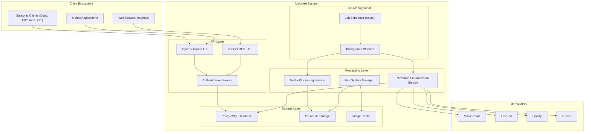
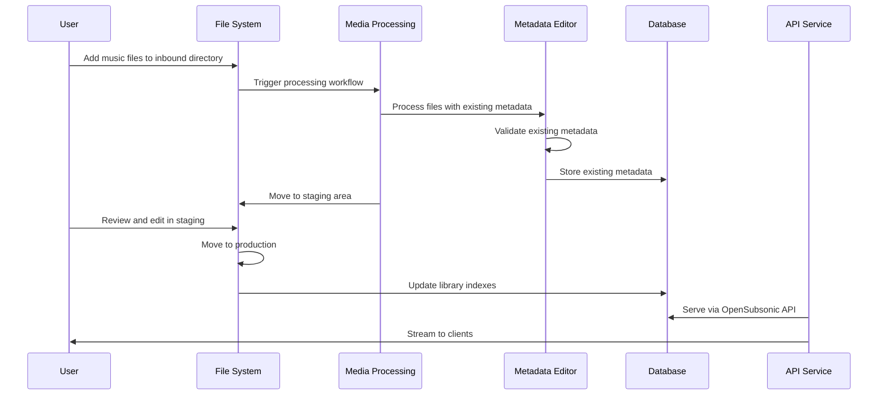
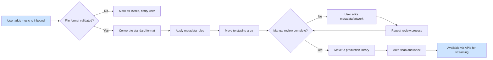
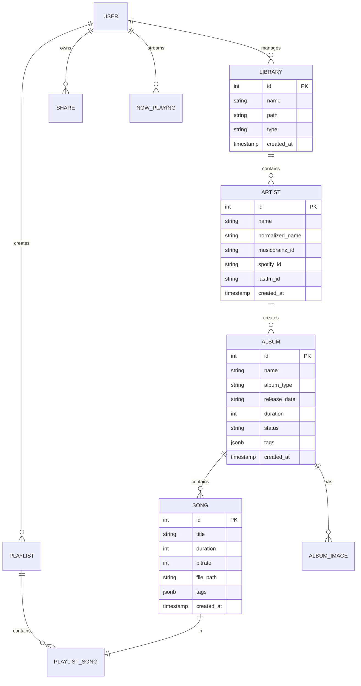
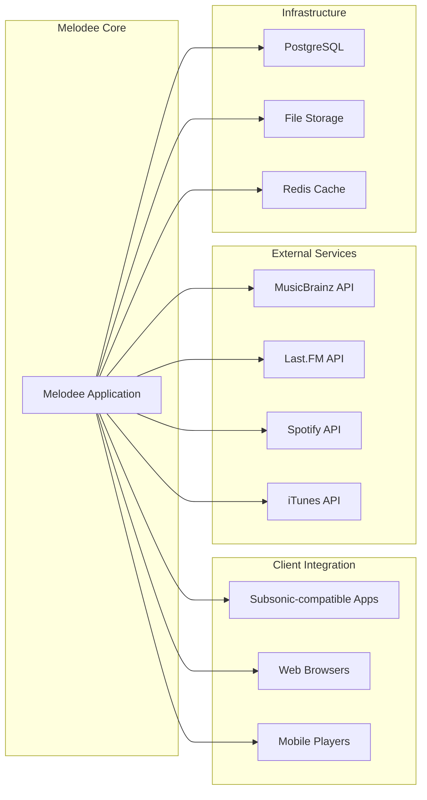

# Melodee - Product Requirements Document (PRD)

## 1. Executive Summary

Melodee is a comprehensive music management and streaming system designed to handle large music libraries with tens of millions of songs. This system provides a complete solution for processing, organizing, and serving music collections through both RESTful and OpenSubsonic-compatible APIs. The application is built for users with substantial music collections who need media processing capabilities, metadata editing, and seamless client integration.

## 2. Product Vision

To create a modern, scalable music management platform that enables users to efficiently organize, process, and stream massive music collections with rich metadata, advanced processing capabilities, and seamless client integration.

## 3. Target Audience

- **Primary Users**: Music enthusiasts with large collections (tens of thousands to millions of songs)
- **Secondary Users**: System administrators managing music streaming services
- **Tertiary Users**: Developers wanting to integrate with music management APIs

## 4. System Architecture Overview

## 5. Core Capabilities

### 5.1 Music Library Management
- Handles music libraries with tens of millions of songs
- Supports multiple audio formats (AAC, AC3, M4A, FLAC, OGG, APE, MP3, WAV, WMA)
- Provides smart media processing with automatic conversion and validation
- Manages three distinct library types: inbound, staging, and production

### 5.2 Processing Pipeline
- **Inbound Processing**: Converts media to standard formats, applies regex-based metadata rules, validates file integrity
- **Staging Management**: Manual editing of metadata before production, album art management, quality control workflow
- **Production Libraries**: Automated scanning and indexing, multiple storage library support, real-time updates

### 5.3 Directory Organization
- **Directory Code Generation**: Automatic creation of unique directory codes for artists to prevent deep directory structures
- **Configurable Layouts**: Support for customizable directory templates using placeholders: {library}, {artist_dir_code}, {artist}, {album}, {year}, etc.
- **Performance Optimization**: Hierarchical organization to manage large music collections (300k+ artists) efficiently
- **Collision Handling**: Automatic resolution of directory code conflicts with suffixes (e.g., "LZ", "LZ-2")
- **Database Integration**: Directory codes integrated into database schema for efficient path resolution and searching

### 5.4 Metadata Management
- Supports various metadata formats (NFO, M3U, SFV files)
- Provides UI for editing existing metadata in place
- Saves metadata changes back to media files and database records
- Manages duplicate detection and resolution
- Maintains existing metadata without automatic external enhancement

### 5.5 API Compatibility
- Full OpenSubsonic API compatibility (Subsonic 1.16.1 specification)
- Supports popular Subsonic clients like Dsub, Supersonic, Ultrasonic
- Real-time transcoding support for various formats (OGG, Opus)
- Playlist management with static and dynamic (JSON-based) options

### 5.6 Job Scheduling
- Redis-based job scheduling system with Asynq for library scanning and updates
- Background processing for metadata updates (edit propagation to files)
- Progress monitoring for long-running operations
- Configurable scan intervals

### 5.7 Metadata Editing
- In-browser metadata editing capabilities
- Bulk editing tools for artists, albums, and songs
- Changes saved to both database and media files
- History tracking for metadata changes

## 6. User Experience Flow

## 7. Data Model Overview

## 8. Key Features and Use Cases

### 8.1 User Management
- User registration with first-user admin privileges
- Role-based access control
- Authentication with secure tokens
- Profile management with avatar support

### 8.2 Streaming Capabilities
- Real-time audio transcoding
- Bandwidth limiting to prevent network congestion
- Support for multiple concurrent streams
- Cross-platform client compatibility

### 8.3 Administration
- Web-based administration interface
- Job scheduling and monitoring
- Library statistics and reporting
- Backup/restore capabilities

### 8.4 Extensibility
- Plugin architecture for metadata sources
- Support for custom file parsers
- Extensible processing pipeline
- Customizable metadata rules

## 9. Technical Requirements

### 9.1 Performance Requirements
- Support for libraries with tens of millions of songs
- Sub-2-second response times for common operations
- Concurrent streaming to multiple clients without degradation
- Efficient database queries for large datasets

### 9.2 Scalability Requirements
- Horizontal scaling for increased load
- Distributed file storage support
- Connection pooling for database operations
- Efficient caching strategies

### 9.3 Security Requirements
- Secure user authentication
- HTTPS support by default
- Input validation and sanitization
- Protection against common web vulnerabilities

## 10. Deployment and Operations

### 10.1 Container Deployment
- Full Docker/Podman support
- PostgreSQL database container
- Separate volumes for different purposes:
  - Storage: Processed music files
  - Inbound: New media for processing
  - Staging: Media for manual review
  - User Images: Avatars and user content
  - Playlists: Dynamic playlist definitions
  - Database: PostgreSQL data

### 10.2 System Integration
- Health check endpoints for monitoring
- Automatic database migrations
- Reverse proxy configuration support
- Logging with structured output

## 11. Integration Ecosystem

## 12. Success Criteria

### 12.1 Performance Metrics
- Library scan completion time for 100k songs under 10 minutes
- Database query performance for common operations under 500ms
- Support for 100+ concurrent streaming sessions
- Average API response time under 2 seconds

### 12.2 Usability Metrics
- 90% of new users complete initial setup in under 10 minutes
- User interface task completion rate over 95%
- Error rate for user operations under 1%